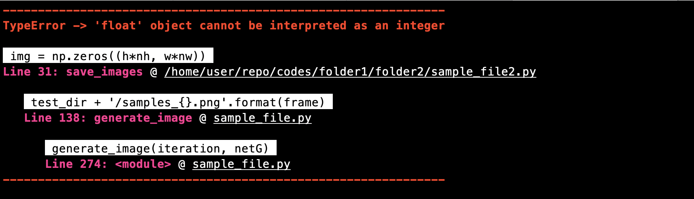
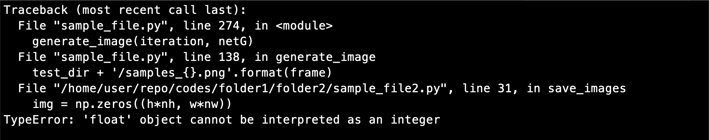
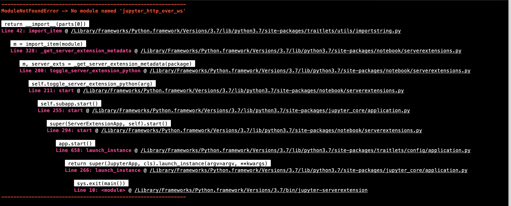
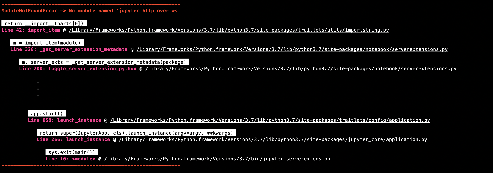

# MyErrVisualizer
MyErrVisualizer is an utility to better showcase a Traceback generated from Errors while running a Python File!
<br>

<h4> For Web Version </h4>
[MyErrVisualizer on Heroku](https://my-err-visualizer.herokuapp.com)

<h4> For CLI </h4>
[Download just ONE file! - myErrVisualizer.py](myErrVisualizer.py)
<br>

# Man Page like Description

<h2 style="color:tomato"> Name </h2>
myErrVisualizer - MyErrVisualizer is an utility to better showcase a Traceback generated from Errors while running a Python File

<h2 style="color:tomato"> Synopsis </h2>

```myErrVisualizer ERROR_FILE_PATH... [NUM_CALLS]...```

<h2 style="color:tomato"> Description </h2>
A Simple Command-Line Utility to Visualize your Python Errors

It is often time-consuming for me to go through python error traceback calls to figure which file, which function and which line has the error. Also, the error statement is buried deep down in those traces which is hard to read. I attempt in this utility to increase the readability of python error logs.

Note: Use of ```NUM_CALLS``` is only supported for standard error logs and not unenven logs, See Caveats to understand the differnce.


<h2 style="color:teal"> Showcase </h2>

<h4 style="color:teal"> Comparision: MyErrVisualizer v/s Typical Python Error </h4>


myErrVisualizer in a Terminal Window



Typical Python Error shown in a Terminal Window


<h4 style="color:teal"> Comparision: MyErrVisualizer v/s Typical Python Error in Jupyter Notebook Logs </h4>


myErrVisualizer in a Terminal Window


Typical Python Error shown in a Terminal Window

<br>

With Options like ```num_calls``` to show only First and Last ```n``` Calls. (Here, ```n=3```)




<h2 style="color:tomato"> Options </h2>
Describes all Options of myErrVisualizer

    -f		Provide the Error File Name that contains
            Python Error Traceback Calls After -f or --err_file_path option
    --err_file_path		 

    -n		Number of Error Calls to be printed, default=None
            (only works with standard error tracesback calls)
    --num_calls		 


    -h		Shows Usage Help
    --help

<h2 style="color:tomato"> Usage </h2>

When creating a error file of the traceback calls, include logs starting from the line that states ```Traceback (most recent call last):``` to ```SomeError: Error Message that is displayed```


```shell
python myErrVisualizer.py                			# Displays Help Page
python myErrVisualizer.py   -f   error_file.err			# Provide an error file
python myErrVisualizer.py   -f   error_file.err   -n   3	# Provide number of calls to showcase, default=None
```
alternatively,

```shell
python myErrVisualizer.py   --err_file_path   error_file.err
python myErrVisualizer.py   --err_file_path   error_file.err   --num_calls   3
```

<h2 style="color:tomato"> Caveats </h2>
<h4 style="color:teal"> Standard Traceback Calls: </h4>

```
Traceback (most recent call last):
  File "sample_file.py", line 274, in <module>
    generate_image(iteration, netG)
  File "sample_file.py", line 138, in generate_image
    test_dir + '/samples_{}.png'.format(frame)
  File "/home/user/repo/codes/folder1/folder2/sample_file2.py", line 31, in save_images
    img = np.zeros((h*nh, w*nw))
TypeError: 'float' object cannot be interpreted as an integer
```

i.e., Each line starting with ```File``` is followed by a code with referencing(tracing)
back to the original error, usually a file line and code line pattern.

<h4 style="color:teal"> Unenven Traceback Calls: </h4>

```
Traceback (most recent call last):
  File "sample_file.py", line 274, in <module>
  File "sample_file.py", line 138, in generate_image
    test_dir + '/samples_{}.png'.format(frame)
  File "/home/user/repo/codes/folder1/folder2/sample_file2.py", line 31, in save_images
    img = np.zeros((h*nh, w*nw))
TypeError: 'float' object cannot be interpreted as an integer
```
i.e., Each line starting with ```File``` may not be followed by a code

<h2 style="color:tomato"> Version </h2>
Beta 0.1 - Only Supports Unix Systems (i.e, macOS, OS X, Linux - Ubuntu), Supports Python 2.x and 3.x

<h2 style="color:tomato"> Author </h2>
Written by Saumil Shah. <a href="https://hellosaumil.github.io"> https://hellosaumil.github.io </a>
<br> More details about this project can be found at : <a href="https://github.com/hellosaumil/MyErrVisualizer"> https://github.com/hellosaumil/MyErrVisualizer </a>
<br>
[Download source code here!](/)

<h2 style="color:tomato"> Reporintg Bugs </h2>
Report bugs to <a href="https://github.com/hellosaumil/MyErrVisualizer/issues"> https://github.com/hellosaumil/MyErrVisualizer/issues </a>
